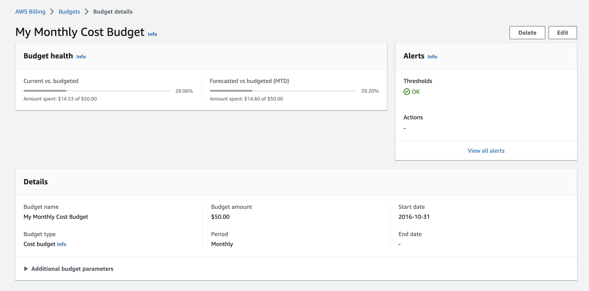

# Week 0 — Billing and Architecture

## Conceptual and logical Charts
For this project I've created three charts
* Conceptual Chart for Application
* Logical Chart for Application
* Logical Chart for CI/CD

__Link to these charts:__ https://lucid.app/lucidchart/97d7793e-a475-493c-bf41-907547a2fe77/edit?viewport_loc=-750%2C-156%2C4416%2C2232%2C0_0&invitationId=inv_b328b705-cc6f-498c-bb29-a7c3c3f50f8f

##### Conceputal Chart for Application

##### Logical Chart for Application

##### Logical Chart for CI/CD

## Destroy your root account credentials & Set MFA

## Creating Billing Alarm & Budgets
For this I created a Bash script __(aws/aws-scripts.sh)__ that provides a simple menu-driven interface for creating various resources related to monitoring and cost control in AWS.
The script defines three functions: create-billing-alarm, create-monthly-budget & create-health-dashboard-notification.

##### Create Billing Alarm
This function creates a CloudWatch alarm for billing-related metrics and sends notifications to an SNS topic subscribed by the email address specified in the function. It updates a JSON file (json/alarm_config.json) with the SNS topic ARN and creates the CloudWatch alarm based on the updated file. After creating the alarm, it removes the JSON file.

##### Create Monthly Budget
This function creates a budget for AWS account and subscribes an SNS topic to the budget. It takes the account ID from the user's AWS credentials and uses two JSON files (json/budget.json and json/notifications-with-subscribers.json) to create the budget and add the SNS topic subscription.

I included three thresholds for this monthy budget:
* When Actual Cost > 85%
* When Actual Cost > 100%
* When Forecasted Cost > 100%

##### Create Health Dashboard Notification
This function creates an SNS topic and subscribes an email address to the topic. It then creates an Amazon CloudWatch Events rule to send Health events to the SNS topic. After creating the rule, it adds the SNS topic as a target to the rule.

## Support ticket and service limit

##### Service Quotas
I requested a service quotas increase for S3 buckets. Currently I have 100 buckets service limit and I requested to increase it to 200.

##### Support ticket
Automatically it opened a support ticket:

