# Week 1 — App Containerization

### 1. Added Dockerfile & docker compose files
I added Dockerfile files for frontend and backend, also added docker compose file in the root folder.

* Commit for this: [46032098aa827d9cd15676311a5a5044f2155d4f](https://github.com/FreskimAliu/aws-bootcamp-cruddur-2023/commit/46032098aa827d9cd15676311a5a5044f2155d4f)

### 2. Completed Notifications page
Created new Flask endpoint for notification & also added React page for the frontend part:

* Commit for this change: [4d2f83e2c06067101394d848f83eda969b27cc46](https://github.com/FreskimAliu/aws-bootcamp-cruddur-2023/commit/4d2f83e2c06067101394d848f83eda969b27cc46)

### 3. Added Dynamodb local & Postgres configuration
Added configuration for DynamoDB local & postgres in docker-compose.yml file and run them in my gitpod environment & my local machine.

* Commit for this change: [04c142db74fed00bf36fce2eecfe281374445272](https://github.com/FreskimAliu/aws-bootcamp-cruddur-2023/commit/04c142db74fed00bf36fce2eecfe281374445272)

---

## Challenge Homeworks

### 1. Run the dockerfile CMD as an external script
Created a script called ``run.sh`` which will start flask application.
```
#! /bin/sh
python3 -m flask run --host=0.0.0.0 --port=4567
```
And on Dockerfile I just updated the CMD commmand.
``CMD ["sh", "run.sh"]``

* Here is the commit of this change: [b814b54a485632f3cd3ed499998daab2bd5c7fd9](https://github.com/FreskimAliu/aws-bootcamp-cruddur-2023/commit/b814b54a485632f3cd3ed499998daab2bd5c7fd9)

---

### 2. Push and tag a image to DockerHub
For this I created a script to push images to Dockerhub. The script is called `push-to-dockerhub.sh` and is placed in root folder.

In this script, I'm tagging images with two tags: latest & a timestamp that I generate with this command `tag=$(date +%Y%m%d%H%M%S)`. 

I created an account in Dockerhub and created repositories for both projects:

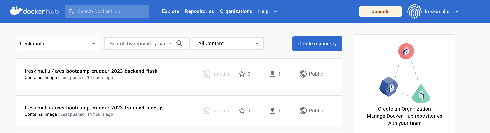

Here are some tags that I've pushed to repositories in DockerHub

Frontend:

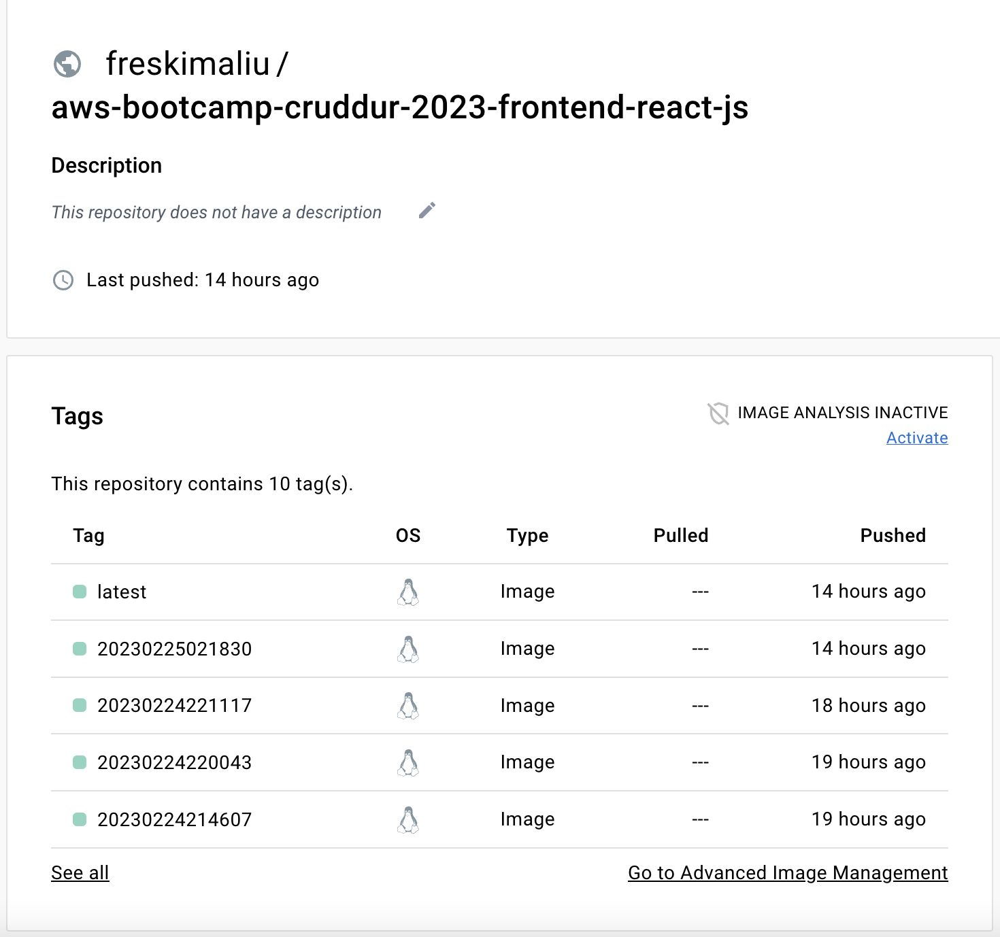

Backend:

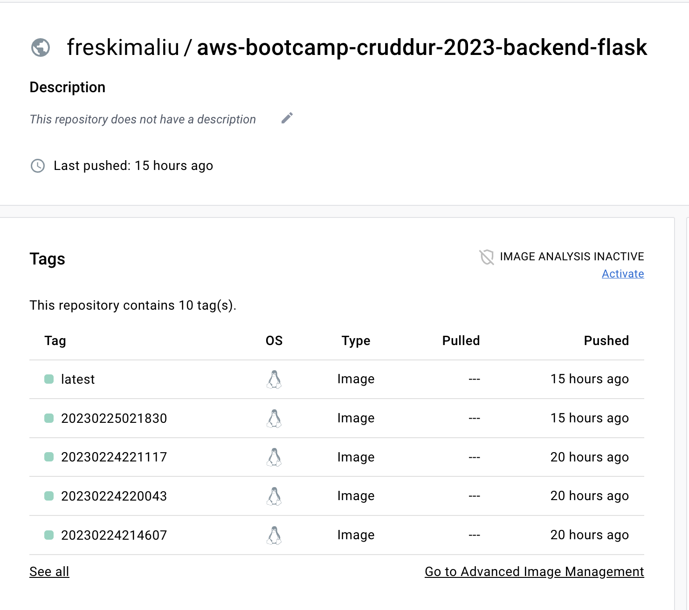

* Here is the commit of this change:
[04c142db74fed00bf36fce2eecfe281374445272](https://github.com/FreskimAliu/aws-bootcamp-cruddur-2023/commit/04c142db74fed00bf36fce2eecfe281374445272)
---

### 3. Use multi-stage building for a Dockerfile build
For this challenge I update Dockerfile files for both projects and used multi-stage builing.

Size of docker images before implementing multi-stage:
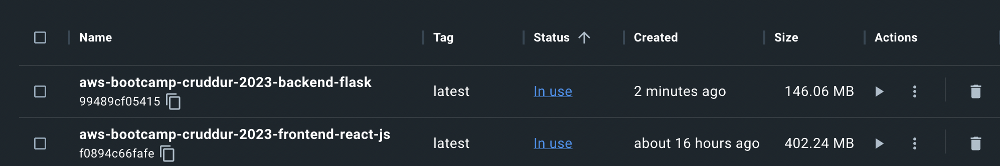

Size of docker image after implementing multi-stage:
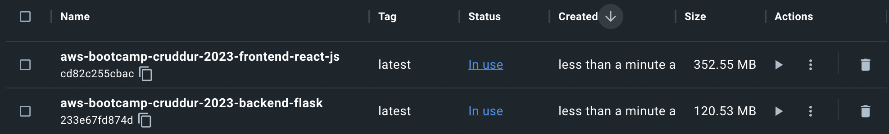

* Here is the commit for this change: 
[041b3e9c337de2c8b74370bf62a32ea8802ca85d](https://github.com/FreskimAliu/aws-bootcamp-cruddur-2023/commit/041b3e9c337de2c8b74370bf62a32ea8802ca85d)
---

### 4. Implement a healthcheck 
For this challenge I created a endpoint in app called /health so I can hit it when I want to check if application is healthy. In docker-compose file I added the healthcheck part and the part where frontend service will wait until backend service is healthy.
````
@app.route("/health", methods=['GET'])
def healthcheck():
    return jsonify({'status': 'ok'})
````
````
healthcheck:
    test: ["CMD", "curl", "-f", "https://4567-${GITPOD_WORKSPACE_ID}.${GITPOD_WORKSPACE_CLUSTER_HOST}/health"]
    interval: 20s
    timeout: 5s
    retries: 3
````
````
    depends_on:
      backend-flask: 
        condition: service_healthy
````


Result of implementation:

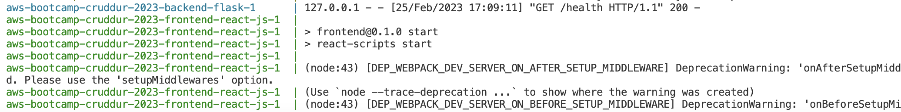

* Here is the commit for this change:
[c7cb7529d45fed80cd4a0dff19a5bcaff1f354ea](https://github.com/FreskimAliu/aws-bootcamp-cruddur-2023/commit/c7cb7529d45fed80cd4a0dff19a5bcaff1f354ea)
---

### 5. Research best practices of Dockerfiles and attempt to implement it in your Dockerfile
Some of the best practices that a Dockerfile should have and I implemented are:
* Not using root user to run docker commands
* Using small images like alpine, slim & use specific version of base docker image
* Using multi-stage builds (Also was a challenge from the bootcamp)
* Fixing security vulnerabilities in Dockerfile using Snyk:

  [Snyk PR for Frontend Dockerfile](https://github.com/FreskimAliu/aws-bootcamp-cruddur-2023/pull/1)

  [Snyk PR for Backend Dockerfile](https://github.com/FreskimAliu/aws-bootcamp-cruddur-2023/pull/2)

* Linting Dockerfile using hadolint (Installed it in gitpod) [605a8f997c0eb45b43898acd749992dc9e6a618b](https://github.com/FreskimAliu/aws-bootcamp-cruddur-2023/commit/605a8f997c0eb45b43898acd749992dc9e6a618b)
---

### 6. Learn how to install Docker on your localmachine and get the same containers running outside of Gitpod / Codespaces
For this challenge I created another docker compose file called `docker-compose.local.yml` to use it in my localmachine. I created this file so I don't have to change environment variables for each environment.
For my local environment I run this command: 
`docker compose -f docker-compose.local.yml up`

Containers running in my local machine in Docker Desktop:
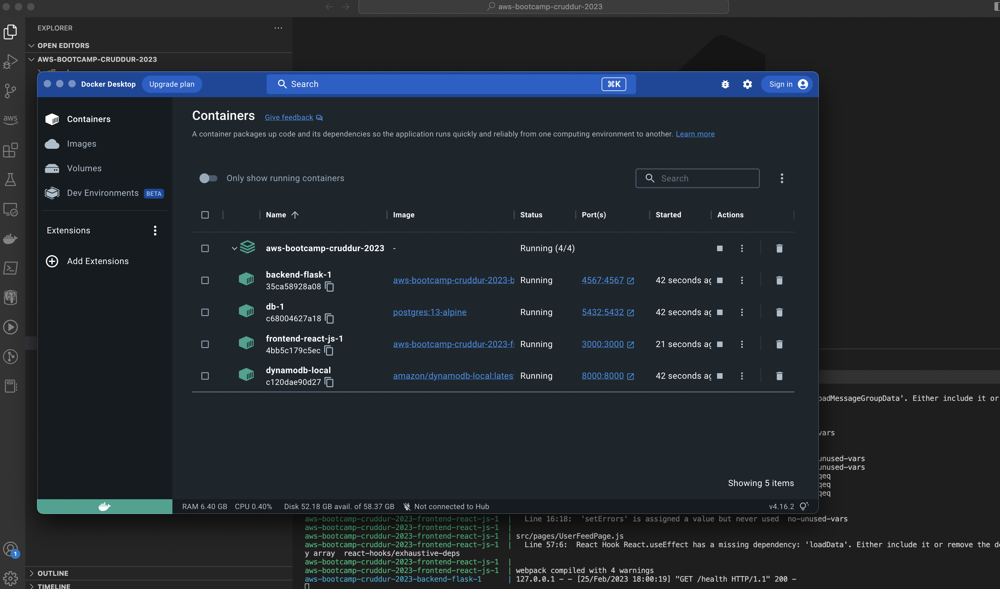

Accessing application in my local machine:
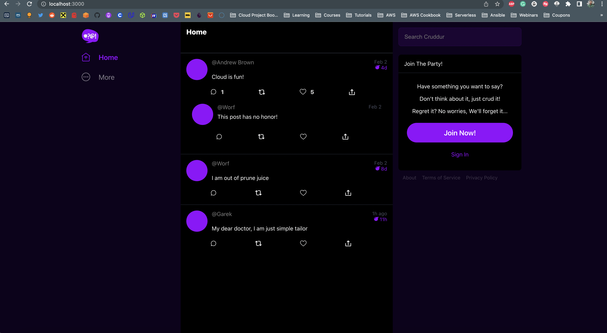

---

### 7. Launch an EC2 instance that has docker installed, and pull a container to demonstrate you can run your own docker processes. 

For this I created an EC2 instance with these specifications:
* Amazon Linux 2
* t2.micro (free-tier)
* Default VPC
* Public Subnet #1

Inside instance I installed the following things:
* Docker & docker compose 
* Git

I had to update docker-compose file to change environment variables that were poiting to gitpod endpoints;

Also I had to update EC2 instance security group to add some inbound rules:

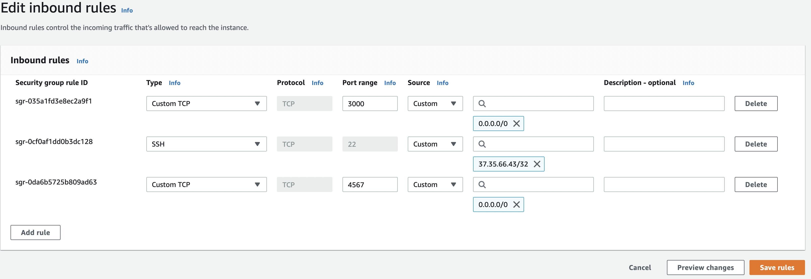

Here are containers that are running inside EC2 instance:

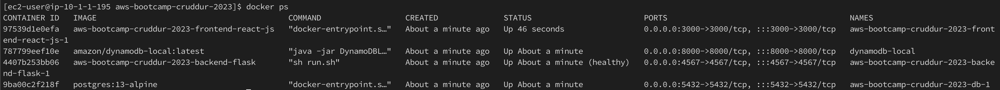

Accessing application from EC2 instance:
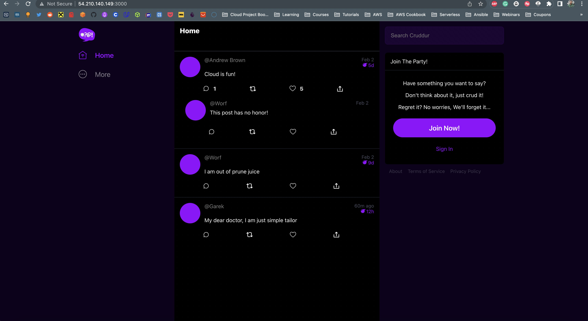

---
